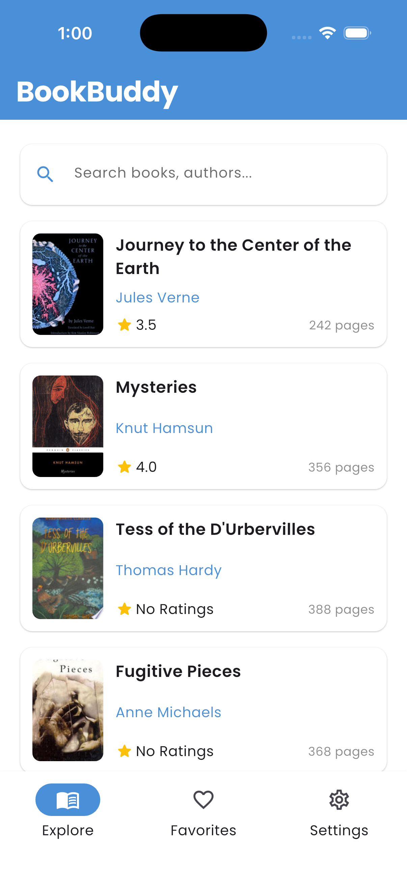
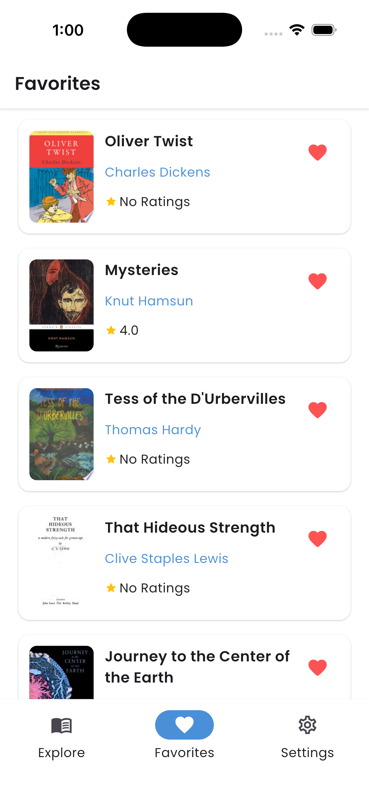
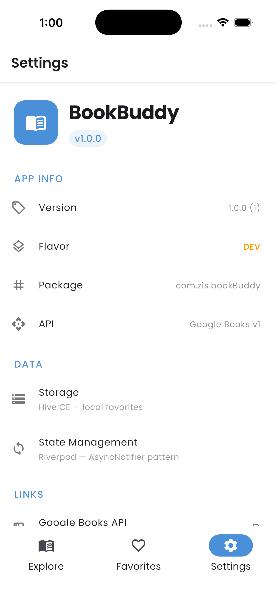

# BookBuddy 📚

A Flutter app to search, browse, and save favorite books using the Google Books API.

> All available commands → [COMMAND.md](./COMMAND.md)

---

## Setup Instructions

### Prerequisites
- Flutter SDK `>= 3.x`
- Google Books API key → [console.cloud.google.com](https://console.cloud.google.com) → Enable **Books API** → Create credentials

### Install

```bash
git clone https://github.com/Sohan-14/BookBuddy
cd BookBuddy
flutter pub get
dart run build_runner build --delete-conflicting-outputs
```

### Run

**Dev**
```bash
flutter run -t lib/main_dev.dart \
  --dart-define=FLAVOR=dev \
  --dart-define=APP_NAME="BookBuddy Dev" \
  --dart-define=APP_SUFFIX=.dev \
  --dart-define=BOOKS_API_KEY=YOUR_DEV_KEY \
  --dart-define=BOOKS_BASE_URL=https://www.googleapis.com/books/v1
```

**Prod**
```bash
flutter run -t lib/main_prod.dart \
  --dart-define=FLAVOR=prod \
  --dart-define=APP_NAME="BookBuddy" \
  --dart-define=APP_SUFFIX="" \
  --dart-define=BOOKS_API_KEY=YOUR_PROD_KEY \
  --dart-define=BOOKS_BASE_URL=https://www.googleapis.com/books/v1
```

VSCode users: select a flavor from the Run panel using `.vscode/launch.json`.

---

## Flavor Setup

No flavor packages used. Flavors are handled via `--dart-define` passed at run time and read in Dart through `String.fromEnvironment()` inside `FlavorConfig`.

Two entry points — `main_dev.dart` and `main_prod.dart` — each initializes `FlavorConfig` before the app starts.

| | Dev | Prod |
|---|---|---|
| App name | BookBuddy Dev | BookBuddy |
| Entry point | `main_dev.dart` | `main_prod.dart` |
| API key | Separate dev key | Separate prod key |

To add a new flavor: create a new entry point `main_staging.dart`, add a new `--dart-define=FLAVOR=staging` run config, and handle it in `FlavorConfig`.

---

## State Management

Riverpod with `@riverpod` code generation — modern annotation style, not legacy `StateNotifier`.

| Provider | Type | Responsibility |
|---|---|---|
| `BookListNotifier` | `AsyncNotifier` | Paginated list, search, pull to refresh |
| `FavoritesNotifier` | `Notifier` | Sync Hive reads/writes, favourite toggle |
| `AppRouter` | `keepAlive` provider | GoRouter single instance |


- `FavoritesNotifier` uses `.select()` per book ID — toggling one favorite rebuilds only that book's widget, not the entire list
- Error flow: datasource throws → repository  → notifier  → UI pattern matches `AsyncValue.error`

---

## Screenshots & Demo

| Explore | Detail | Favorites | Settings |
|---|---|---|---|
|  |  |  |  |

**Demo**


